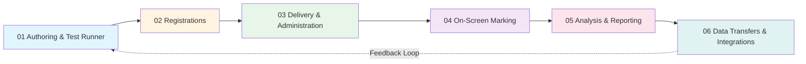

# Assessment Lifecycle

The VEA (Vretta e-Assessment) system follows a structured six-stage lifecycle for managing educational assessments from creation through data export. This document outlines each stage and how they relate to the Data Lakehouse DAG system.

## Lifecycle Overview

The assessment lifecycle represents the complete journey of an assessment from initial authoring through final data transfers. Each stage produces data that feeds into subsequent stages, creating a continuous cycle of assessment management and improvement.

## Stage Definitions

### 01 Authoring & Test Runner

**Purpose**: Creating the assessments and setting up the test environment.

This stage involves the design and configuration of assessments, including:
- **Test Design** creation: Defining the blueprint for assessments with items, modules, and forms
- **Test Window TD Allocation Rules (TWTAR)**: Allocating test designs to test windows with specific configurations
- **Form Design**: Creating test form variations with different item orders or item sets
- **Item Development**: Creating assessment items with expected responses and scoring rules
- **Accommodation Options**: Defining available accommodations for students
- **Test Window Configuration**: Setting up test windows with dates, security settings, and other parameters

**Related Query Categories**:
- [00a Metadata Queries](../queries/q00a_meta/index.md): Codebook tables and field definitions
- [00b System Queries](../queries/q00b_sys/index.md): Test window configuration
- [01a Assessment Specifications](../queries/q01a_asmt_specs/index.md): Test window allocation rules, accommodation options, response type patterns
- [01b Assessment Content](../queries/q01b_asmt_content/index.md): Test designs, form designs, items, item registers, expected responses

**Key Data Entities**:
- Test Designs
- Test Forms
- Items
- Test Window TD Allocation Rules (TWTARs)
- Test Windows

### 02 Registrations

**Purpose**: Managing the enrollment of candidates or students for the assessments.

This stage handles all aspects of student and organizational registration:
- **School Management**: Registering schools, districts, and organizational groupings
- **Student Registration**: Enrolling students in the system and linking them to schools
- **Class Organization**: Creating class groupings and assigning students to classes
- **Form Allocation**: Assigning specific test forms to classes or students
- **Accommodations**: Assigning accommodations to students who need them
- **Exceptions**: Managing individual student exceptions and special considerations
- **User Roles**: Assigning teachers, administrators, and other user roles

**Related Query Categories**:
- [02a Groups](../queries/q02a_groups/index.md): Schools, school codes, school groupings
- [02b Registrations](../queries/q02b_registrations/index.md): Students, enrollments, accommodations, exceptions, class form allocations, user roles

**Key Data Entities**:
- Schools
- Students
- School Groupings
- Student Enrollments
- Accommodations
- Exceptions
- Class Form Allocations

### 03 Delivery & Administration

**Purpose**: Overseeing the delivery of the assessment and its logistics.

This stage manages the actual administration of assessments:
- **Test Window Management**: Activating and managing test windows during the assessment period
- **Test Attempt Creation**: Creating and tracking student test attempts
- **Test Session Management**: Managing individual test sessions within attempts
- **Response Collection**: Capturing student responses to assessment items
- **Administrative Oversight**: Monitoring test administration, handling technical issues, and managing test logistics
- **Security & Integrity**: Ensuring assessment security and preventing cheating

**Related Query Categories**:
- [00b System Queries](../queries/q00b_sys/index.md): Test window status and configuration
- [03a Attempts](../queries/q03a_attempts/index.md): Test attempts, test sessions, attempt details
- [03b Responses](../queries/q03b_responses/index.md): Student responses, response exceptions
- [03c Scans](../queries/q03c_scans/index.md): Scan information and scan counts

**Key Data Entities**:
- Test Windows (active status)
- Test Attempts
- Test Sessions
- Responses
- Item Exceptions

### 04 On-Screen Marking

**Purpose**: Facilitating the grading process through digital tools.

This stage handles the scoring and marking of assessments:
- **Marking Window Setup**: Creating marking windows to organize the marking process
- **Automated Scoring**: System-scored items (multiple choice, auto-scored items)
- **Human Marking**: On-screen marking tools for constructed response items
- **Marking Pool Management**: Organizing attempts for marking, including pooled marking workflows
- **Score Validation**: Ensuring marking quality and consistency
- **Marking Completion**: Tracking marking progress and completion status

**Related Query Categories**:
- [04 Marking](../queries/q04_marking/index.md): Marking windows, pooled attempts, marking status by assessment code

**Key Data Entities**:
- Marking Windows
- Marking Pooled Attempts
- Marking Status
- Scores

### 05 Analysis & Reporting

**Purpose**: Performing data analysis to evaluate the results and assessment effectiveness.

This stage focuses on analyzing assessment data and generating insights:
- **Score Calculation**: Computing final scores, scale scores, and performance levels
- **Statistical Analysis**: Item analysis, reliability measures, validity studies
- **Performance Reporting**: Generating reports on student, school, and system performance
- **Data Quality Analysis**: Identifying data quality issues and anomalies
- **Assessment Evaluation**: Evaluating assessment effectiveness and item performance
- **Results Compilation**: Aggregating results across students, schools, and districts

**Related Query Categories**:
- [03a Attempts](../queries/q03a_attempts/index.md): Test reports and attempt summaries

**Key Data Entities**:
- Results
- Scores
- Performance Levels
- Statistical Measures

### 06 Data Transfers & Integrations

**Purpose**: Generating reports and handling data transfers based on the analysis.

This stage handles the export and transfer of assessment data:
- **Data Export**: Creating structured data exports using the Data Lakehouse DAG system
- **Report Generation**: Generating formatted reports for stakeholders
- **System Integration**: Transferring data to external systems (e.g., PASI sync, reporting systems)
- **Data Packaging**: Organizing and packaging data for delivery
- **Delta Comparisons**: Comparing exports to identify changes between runs
- **Data Validation**: Ensuring exported data meets quality and completeness requirements

**Related Documentation**:
- [Data Lakehouse DAG Architecture](./readme.md): The DAG system that powers data exports
- [Jobs Model](./models/jobs.md): Job definitions for data exports
- [Assets Model](./models/assets.md): Asset definitions for data processing
- [Queries Index](../queries/index.md): Available data export queries

**Key Data Entities**:
- Export Jobs
- Exported Assets
- Data Packages
- Integration Records

## G1 Systems

**G1 Systems** represent external systems and processes that interact with the VEA assessment lifecycle but are kept outside the main cycle. These may include:

- **Government Systems**: Provincial or state education systems (e.g., PASI for Alberta)
- **Student Information Systems (SIS)**: External student management systems
- **Reporting Platforms**: Third-party reporting and analytics platforms
- **Authentication Systems**: External identity and access management systems
- **Infrastructure Systems**: Cloud services, databases, and other technical infrastructure

G1 Systems typically:
- Provide input data (student records, organizational data)
- Receive output data (results, reports, exports)
- Operate independently of the assessment lifecycle stages
- May trigger or be triggered by lifecycle events

## Data Flow Through the Lifecycle

Data flows sequentially through the lifecycle stages:

1. **Authoring** creates test designs, forms, and items → stored in database
2. **Registrations** links students to test windows and forms → creates enrollment records
3. **Delivery** creates test attempts and captures responses → generates attempt and response data
4. **Marking** scores attempts and validates responses → produces scores and marking records
5. **Analysis** processes scores and generates results → creates analysis and result data
6. **Data Transfers** exports all relevant data → packages data for external systems

The Data Lakehouse DAG system primarily operates in **Stage 06 (Data Transfers & Integrations)**, pulling data from all previous stages to create comprehensive exports. However, the DAG can also be used for analysis and reporting tasks in **Stage 05**.

## Related Documentation

- [Glossary](./glossary.md): Definitions of key terms used throughout the lifecycle
- [Query Documentation](../queries/index.md): Detailed query documentation for each lifecycle stage
- [Data Models](./models/index.md): Data model definitions used in the system

